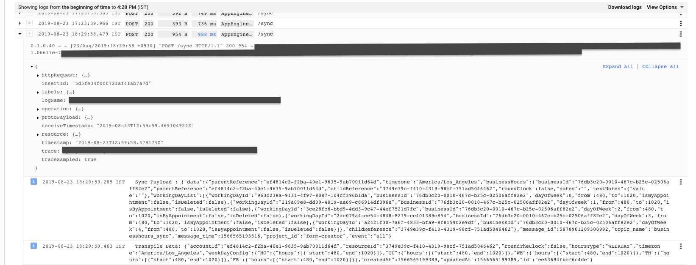

You need enable and use in your application -> @google-cloud/trace-agent

**With Google's solution has limitation which let you use only wherever you have access to the request object**  - https://github.com/googleapis/nodejs-logging-bunyan

But with this you can log anywhere.



Setup: This example shown below will push logs only when it is production or staging server. For dev also using the bunyan logger but this way it saves a cost instead pushing unnecessary local logs to cloud.

config/logger.js
```javascript

import { LoggingBunyan } from '@google-cloud/logging-bunyan';
import createLogger from 'gcp-nodejs-correlate-logs';

import { getProjectId, ifDev } from './config';

// Creates a Bunyan Stackdriver Logging client
const loggingBunyan = new LoggingBunyan();

let loggerOption;

if (ifDev()) {
  const bunyanDebugStream = require('bunyan-debug-stream'); // eslint-disable-line
  loggerOption = {
    name: 'rocket-science',
    streams: [{
      level: 'info',
      type: 'raw',
      stream: bunyanDebugStream({
        forceColor: true,
      }),
    }],
    serializers: bunyanDebugStream.serializers,
  };
} else {
  loggerOption = {
    name: 'rocket-science',
    level: 'info',
    streams: [loggingBunyan.stream('info')],
  };
}


const { loggerContextMiddleware, log } = createLogger(getProjectId() || 'dev', loggerOption);

export { loggerContextMiddleware, log };

```


server.js

```javascript
import express from 'express';

import config, { APPLICATION_MODE } from './config/config';
import { loggerContextMiddleware, log } from './config/logger';

const app = express();

app.use(loggerContextMiddleware); // Should add this middleware for correlating the logs.

app.listen(config.PORT, () => log.info(`Server listening on port ${config.PORT}... Application Mode: ${APPLICATION_MODE}`));

```


Import the log and use it wherever you want. 
/api.js

```javascript
import { Router }  from 'express';

import { log } from './config/logger';

const route = Router();

route.use('/', ( req, res) => { 
  log.info('Seems working');
  res.send('Hello!')
});
```